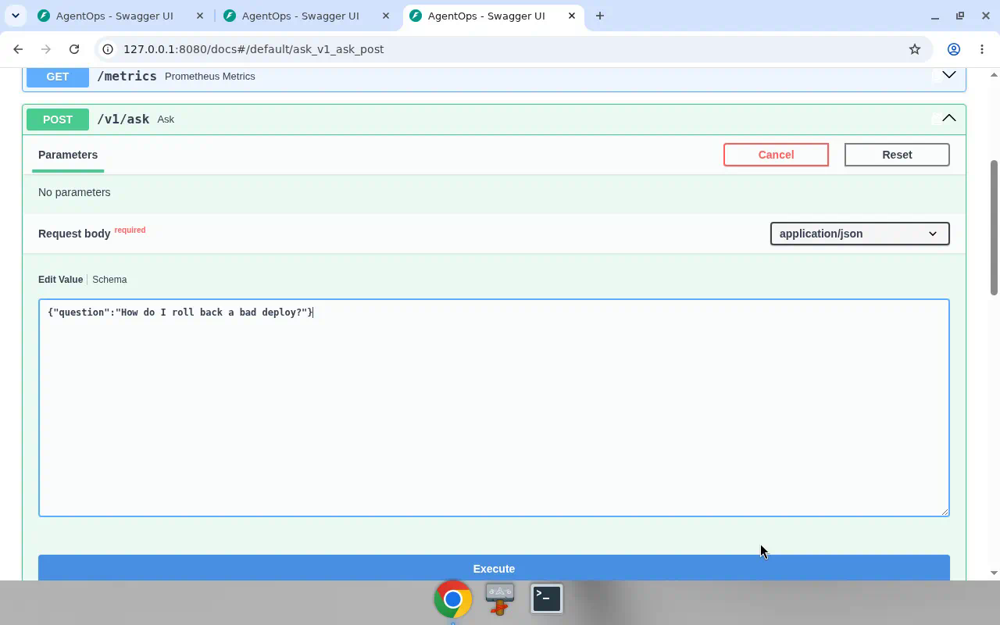
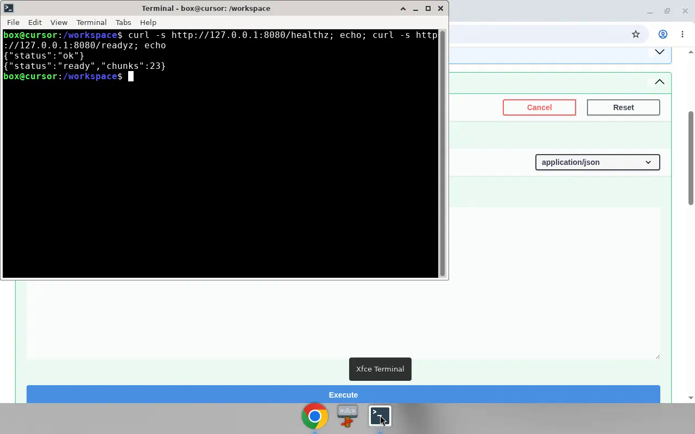
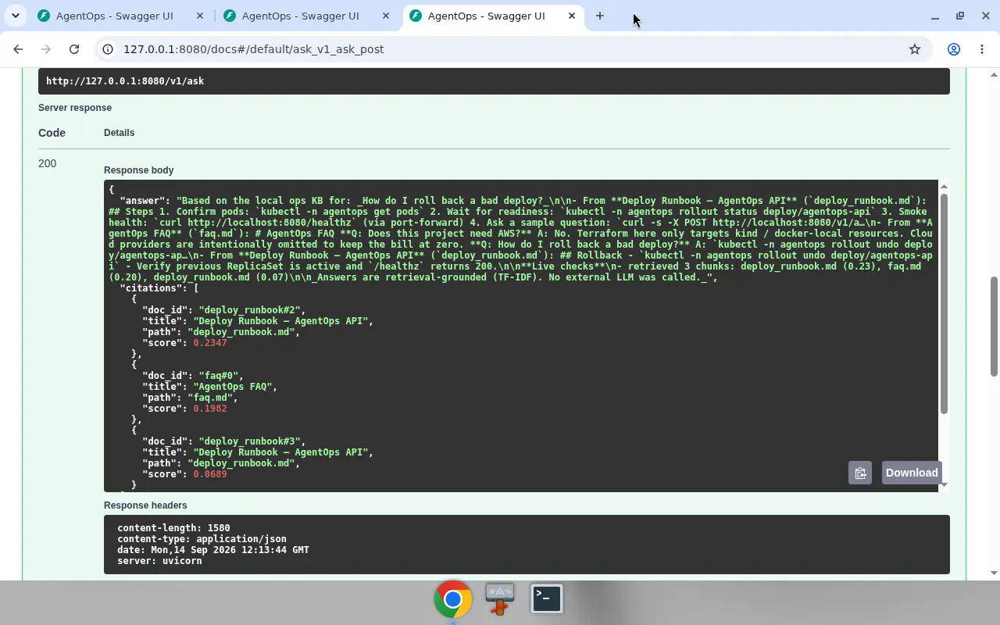

# AgentOps

Local-first **ops knowledge agent** — ask runbook questions, get cited answers, with the same packaging you’d expect in a small production service (FastAPI, metrics, probes, Kustomize, CI).

**₹0 / $0 cloud bill by design.** No AWS/GCP provisioning in this repo. No paid LLM keys required. Everything runs on your laptop via Python venv, Docker Compose, or kind.

Author: Nishant Tyagi ([tnishant082-dev](https://github.com/tnishant082-dev))

---

## Why this exists

I wanted one portfolio repo that covers the Cloud AI Engineer staircase end-to-end without needing a credit card or a reviewer to mint cloud credentials. AgentOps is that sandbox: networking + containers + IaC + k8s + RAG + a tool-calling agent, all local.

---

## Localhost walkthrough

Silent screen capture of the API running on `http://127.0.0.1:8080` (Swagger `/docs`: healthz, readyz, and `/v1/ask`):

[`artifacts/agentops-localhost-demo.mp4`](./artifacts/agentops-localhost-demo.mp4)

### Run screenshots (input → process → output)

**1. Input** — `POST /v1/ask` request body in Swagger (not executed yet):



**2. Process** — local probes before the ask (`/healthz`, `/readyz`):



**3. Output** — cited answer for “How do I roll back a bad deploy?”:



---

## Quick start (no Docker required)

```bash
git clone https://github.com/tnishant082-dev/AgentOps.git
cd AgentOps
python3 -m venv .venv && source .venv/bin/activate
pip install -r requirements.txt

# ingest KB + tests + eval, then serve :8080
./scripts/bootstrap_local.sh
```

In another terminal:

```bash
curl -s http://127.0.0.1:8080/healthz
curl -s -X POST http://127.0.0.1:8080/v1/ask \
  -H 'content-type: application/json' \
  -d '{"question":"How do I roll back a bad deploy?"}' | python -m json.tool
```

---

## Stair map (1 → 5)

| Layer | Folder / command | What it shows |
|------|------------------|---------------|
| **1. Linux / networking / cloud concepts** | `docker-compose.yml`, `data/sample_kb/networking_basics.md` | Bridge network as VPC stand-in; public API vs private prometheus |
| **2. Docker / Terraform / CI** | `services/api/Dockerfile`, `infra/terraform/`, `.github/workflows/ci.yml` | Image build, local-only Terraform (`local`/`null` providers), Actions: lint·test·eval·kustomize·image |
| **3. Kubernetes + observability + GitOps-style** | `k8s/base`, `k8s/overlays/*`, `observability/` | kind-ready manifests, probes, Prometheus scrape, Kustomize overlays applied from CI validation |
| **4. LLM + RAG + vector search** | `services/api/app/rag.py`, `llm.py`, `services/ingest/`, `data/sample_kb/` | Abstracted LLM backend (default offline stub), TF-IDF retrieval over ops markdown |
| **5. Agent in production** | `services/api/app/`, `eval/`, `tests/` | Tool loop (`search_kb`, `get_service_status`), rate limit, `/healthz` `/readyz` `/metrics`, golden eval in CI |

Deeper write-up: [docs/architecture.md](docs/architecture.md)

---

## Architecture

```mermaid
flowchart LR
  Client -->|POST /v1/ask| API[FastAPI AgentOps]
  API --> RL[Rate limiter]
  RL --> Agent[OpsAgent loop]
  Agent --> KB[(TF-IDF KB)]
  Agent --> Mock[Mock service status]
  Agent --> Stub[LocalStub LLM]
  API --> Metrics[/metrics]
  Prom[Prometheus] -->|scrape| Metrics
  subgraph packaging
    Compose[docker compose]
    Kind[kind + Kustomize]
  end
  Compose --> API
  Kind --> API
```

---

## Repo layout

```
AgentOps/
  README.md
  docs/architecture.md
  infra/terraform/          # kind/docker helpers — NOT real AWS
  docker-compose.yml
  k8s/base + k8s/overlays/{dev,prod}
  .github/workflows/ci.yml
  services/api/             # FastAPI agent + RAG
  services/ingest/          # KB → manifest
  data/sample_kb/           # runbooks / FAQ
  eval/                     # golden cases (CI gate)
  observability/            # Prometheus + optional Grafana/OTel
  scripts/bootstrap_local.sh
```

---

## Docker Compose (local “cloud”)

```bash
docker compose up --build api prometheus
# optional UI:
docker compose --profile ui up grafana
```

Network `agentops-net` is the stand-in VPC. Prometheus has no host port by default (private service). API publishes `8080`.

---

## kind (optional, for k8s reviewers)

Needs Docker + [kind](https://kind.sigs.k8s.io/) + kubectl on the machine:

```bash
./scripts/kind_up.sh
kubectl -n agentops port-forward svc/agentops-api 8080:80
```

Terraform path (still $0 — writes scripts; set `enable_kind_create=true` only if kind is installed):

```bash
cd infra/terraform
terraform init
terraform plan
terraform apply -var='enable_kind_create=false'
```

---

## Agent behavior

1. Pick tools from the question (`search_kb` always; `get_service_status` when you ask about health/latency/replicas).
2. Retrieve top chunks from the local markdown KB (TF-IDF + cosine).
3. Compose a cited answer with the **local stub** LLM — deterministic, offline.
4. Emit Prometheus counters; enforce a sliding-window rate limit.

Swap-in point for a real model later: `services/api/app/llm.py` (`LLMBackend`). Default stays `local_stub` so clones work without keys.

---

## Eval & CI

```bash
pytest -q
python eval/run_eval.py
```

GitHub Actions runs the same gates and builds the image on push. Manifests are validated with `kustomize build`. No paid registry push is required.

---

## Cost posture

| Resource | In this repo? |
|----------|----------------|
| AWS / GCP / Azure resources | **No** |
| Hosted LLM API (required) | **No** |
| kind / Docker / local Python | Yes |
| Public GHCR (optional, free for public images) | Optional only |

If you later want EKS + Bedrock, that would be a **separate** follow-up — not included here on purpose.

---

## Sample questions

- How do I roll back a bad deploy?
- What should I do in the first 15 minutes of an elevated error rate?
- Does AgentOps need AWS?
- How do I create the kind cluster?
- What is the health status of the fleet?

---

## License

MIT — see [LICENSE](LICENSE)
